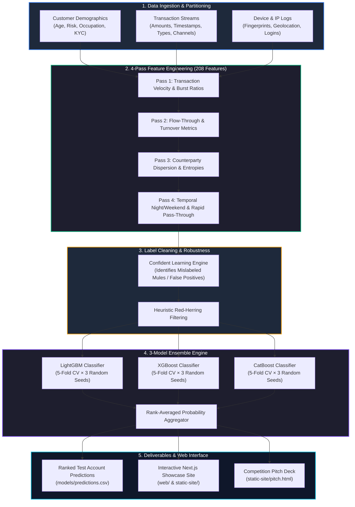
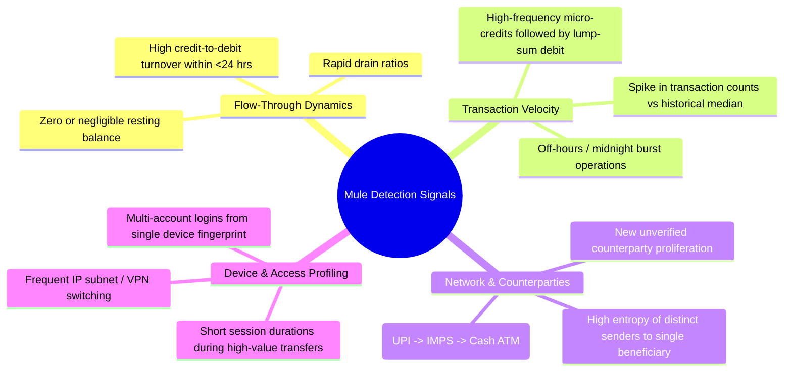

# NFPC Mule Account Detection 🏦🛡️

[](https://www.python.org/)
[](web/)
[](https://lightgbm.readthedocs.io/)
[](https://xgboost.readthedocs.io/)
[](https://catboost.ai/)
[](results/)
[](results/)
[](LICENSE)

An end-to-end **Money Mule Account Detection & Risk Scoring System** developed for the **National Fraud Prevention Challenge (NFPC)** (hosted by **Reserve Bank Innovation Hub (RBIH)** in association with **IIT Delhi TRYST**).

The solution features a 3-model gradient-boosted ensemble (LightGBM + XGBoost + CatBoost) with 208 engineered features, confident learning for label noise correction, and an interactive Next.js analytics showcase.

---

## ⚡ Executive Summary & Results

In digital payment networks, illicit money is funneled through layers of mule accounts to obscure transaction trails. This repository implements an end-to-end machine learning pipeline to identify mule accounts from large-scale banking data.

### 🏆 Challenge Performance

| Phase | Evaluation Partition | Metric | Score | Key Components |
| :--- | :--- | :--- | :---: | :--- |
| **Phase 2 (Final)** | **Public Leaderboard** | **AUC-ROC** | **0.968136** | 3-Model Ensemble (LGBM + XGB + CatBoost), 208 features |
| **Phase 2 (Final)** | **Private Leaderboard** | **AUC-ROC** | **0.955815** | 3-seed × 5-fold CV, rank averaging, confident learning |
| **Phase 1** | **Out-of-Fold (OOF)** | **AUC-ROC** | **0.985100** | 125 features across 13 behavioral categories |

---

## 🏗️ End-to-End System Architecture



---

## 🎯 Key Behavioral Signals & Feature Taxonomy

The pipeline extracts **208 engineered features** capturing distinctive mule typologies:



---

## 🚀 Quick Start & Local Run

### 1. Run the Interactive Web Showcase (Local Server)

A standalone showcase site and pitch deck are pre-bundled:

```bash
# Serve the pre-built interactive dashboard
python -m http.server 8080 --directory static-site
```

Visit in your browser:
- **Main Showcase Dashboard:** [http://localhost:8080](http://localhost:8080)
- **Competition Pitch Deck:** [http://localhost:8080/pitch.html](http://localhost:8080/pitch.html)

### 2. Run the Next.js Web Application

```bash
cd web
npm install
npm run dev
```

Visit: [http://localhost:3000](http://localhost:3000)

---

## 📊 Precomputed Models & Outputs

The repository includes pre-generated evaluation outputs:

- **[`models/predictions.csv`](file:///C:/Users/sakth/.gemini/antigravity-ide/scratch/nfpc-mule-detection-main/models/predictions.csv):** 15,848 test accounts scored with probability predictions.
- **[`models/feature_importance.csv`](file:///C:/Users/sakth/.gemini/antigravity-ide/scratch/nfpc-mule-detection-main/models/feature_importance.csv):** 123 top features ranked by model gain.
- **[`reports/NFPC_Phase1_EDA_Report.md`](file:///C:/Users/sakth/.gemini/antigravity-ide/scratch/nfpc-mule-detection-main/reports/NFPC_Phase1_EDA_Report.md):** 47 statistical tables and 25 analytical plots covering transaction patterns.
- **[`round-2/report.html`](file:///C:/Users/sakth/.gemini/antigravity-ide/scratch/nfpc-mule-detection-main/round-2/report.html):** Comprehensive Phase 2 solution report.

---

## 📂 Repository Structure

```text
nfpc-mule-detection/
├── models/
│   ├── predictions.csv             # 15,848 test account predictions
│   └── feature_importance.csv      # 123 features ranked by importance
├── reports/
│   ├── NFPC_Phase1_EDA_Report.md   # Full EDA report
│   └── plots/                      # 25 analytical charts & visualizations
├── round-2/                        # Phase 2 Pipeline & Deliverables
│   ├── pipeline/
│   │   ├── config.py               # Paths, seeds, constants
│   │   ├── features.py             # 4-pass feature engineering
│   │   ├── label_cleaning.py       # Confident learning & noise removal
│   │   ├── models_v3.py            # LGBM + XGBoost + CatBoost ensemble
│   │   ├── temporal.py             # Activity window prediction
│   │   └── run_v3.py               # Orchestrator
│   ├── report.html                 # Solution report (HTML)
│   └── report.md                   # Solution report (Markdown)
├── src/                            # Phase 1 Pipeline
│   ├── full_pipeline.py            # End-to-end Phase 1 pipeline
│   ├── eda_phase1.py               # EDA script
│   └── md_to_html.py               # Report generator
├── static-site/                    # Static showcase HTML pages
│   ├── index.html                  # Main showcase dashboard
│   └── pitch.html                  # Competition pitch deck
├── web/                            # Next.js 16 web application
│   ├── app/                        # Next.js App Router pages
│   └── package.json
├── LICENSE                         # MIT License
├── requirements.txt                # Python dependencies
└── README.md                       # Project documentation
```

---

## 👥 Acknowledgements

- Built for the **National Fraud Prevention Challenge (NFPC)** hosted by **Reserve Bank Innovation Hub (RBIH)** in association with **IIT Delhi TRYST**.
- Upstream solution architecture and research foundation by Team **dmj.one**.

---

## 📄 License

This project is licensed under the [MIT License](LICENSE).
